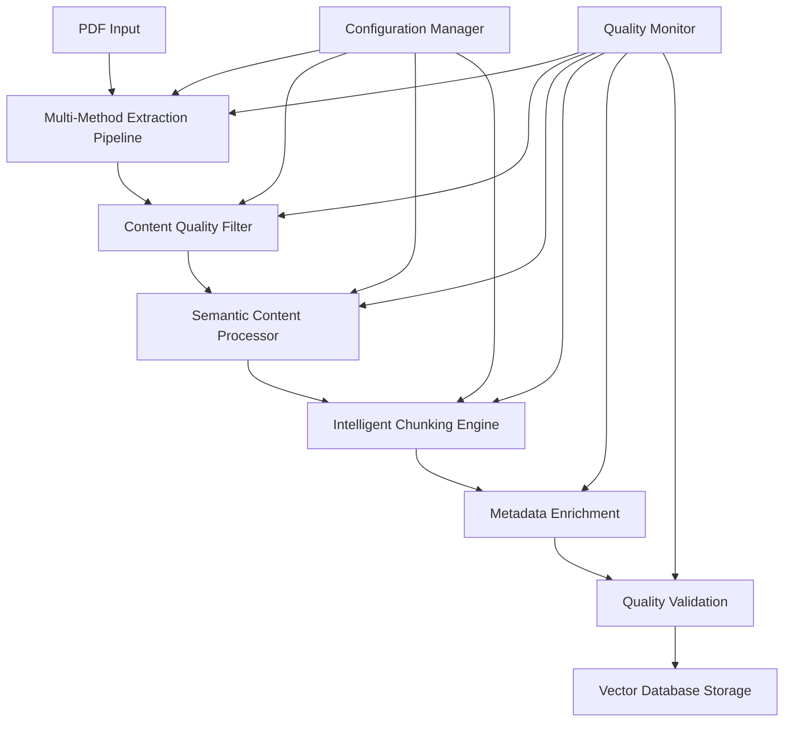

# Enhanced RAG Quality Improvement - Design Document

## Overview

This design implements a multi-stage, intelligent document processing pipeline that transforms noisy PDF textbooks into high-quality, semantically structured knowledge bases. The system uses ensemble extraction methods, advanced content filtering, semantic chunking, and comprehensive quality validation to create an optimal RAG system for educational AI agents.

The design follows a modular architecture with clear separation of concerns, allowing for easy testing, maintenance, and future enhancements. Each component is designed to be independently testable and replaceable.

## Architecture

### High-Level Architecture



### Component Architecture

The system consists of six main components:

1. **Multi-Method Extraction Pipeline**: Orchestrates multiple PDF extraction libraries
2. **Content Quality Filter**: Removes noise and validates content quality
3. **Semantic Content Processor**: Handles tables, formulas, and visual content
4. **Intelligent Chunking Engine**: Creates semantically meaningful content chunks
5. **Metadata Enrichment System**: Adds educational metadata and relationships
6. **Quality Validation Framework**: Monitors and validates system performance

## Components and Interfaces

### 1. Multi-Method Extraction Pipeline

**Purpose**: Extract text using multiple methods and select the best result through ensemble voting.

**Interface**:
```python
class MultiMethodExtractor:
    def extract_content(self, pdf_path: str) -> ExtractionResult
    def compare_extractions(self, results: List[ExtractionResult]) -> ExtractionResult
    def get_confidence_score(self, result: ExtractionResult) -> float
```

**Extraction Methods**:
- **PyMuPDF (fitz)**: Fast, good for simple layouts
- **pdfplumber**: Excellent for tables and precise text positioning
- **Unstructured**: Advanced layout analysis and element detection
- **PyPDF2/pypdf**: Fallback for basic text extraction

**Ensemble Logic**:
- Compare text length, structure preservation, and content coherence
- Use confidence scoring based on extraction quality metrics
- Implement voting mechanism for conflicting results
- Fallback hierarchy: Unstructured → pdfplumber → PyMuPDF → PyPDF2

### 2. Content Quality Filter

**Purpose**: Remove noise, headers, footers, and low-quality content.

**Interface**:
```python
class ContentQualityFilter:
    def filter_noise(self, content: str) -> str
    def remove_headers_footers(self, content: str) -> str
    def validate_educational_content(self, content: str) -> bool
    def calculate_quality_score(self, content: str) -> float
```

**Filtering Rules**:
- Remove page numbers, headers, footers using regex patterns
- Filter out navigation elements and metadata
- Remove content with high repetition or low information density
- Exclude chunks with less than 20 meaningful words
- Remove OCR artifacts and formatting noise

**Quality Metrics**:
- Information density (meaningful words per total words)
- Educational keyword presence
- Sentence structure coherence
- Content uniqueness score

### 3. Semantic Content Processor

**Purpose**: Extract and structure tables, formulas, and visual content.

**Interface**:
```python
class SemanticContentProcessor:
    def extract_tables(self, content: str, pdf_path: str) -> List[TableData]
    def extract_formulas(self, content: str) -> List[FormulaData]
    def process_visual_elements(self, pdf_path: str) -> List[VisualElement]
    def generate_descriptions(self, element: VisualElement) -> str
```

**Table Processing**:
- Use pdfplumber for precise table extraction
- Reconstruct tables spanning multiple pages
- Convert to structured format (JSON/CSV)
- Generate natural language descriptions

**Formula Processing**:
- Detect mathematical expressions using regex and ML models
- Convert to LaTeX format for proper rendering
- Extract variable definitions and relationships
- Link formulas to their explanatory context

**Visual Content Processing**:
- Extract images and diagrams using PyMuPDF
- Generate descriptive text using vision models or rule-based descriptions
- Identify chart types and extract data relationships
- Create alternative text for accessibility

### 4. Intelligent Chunking Engine

**Purpose**: Create semantically meaningful chunks based on educational concepts.

**Interface**:
```python
class IntelligentChunker:
    def create_semantic_chunks(self, content: ProcessedContent) -> List[ContentChunk]
    def identify_concept_boundaries(self, content: str) -> List[int]
    def optimize_chunk_size(self, chunks: List[ContentChunk]) -> List[ContentChunk]
    def preserve_context(self, chunks: List[ContentChunk]) -> List[ContentChunk]
```

**Chunking Strategy**:
- Identify semantic boundaries using NLP techniques
- Preserve complete concepts, definitions, and examples
- Maintain optimal chunk size (200-800 tokens)
- Add context overlap between related chunks
- Create specialized chunks for exercises, definitions, and examples

**Boundary Detection**:
- Use sentence transformers to identify topic shifts
- Detect section headers and structural elements
- Identify definition patterns and example markers
- Preserve mathematical derivations and proofs

### 5. Metadata Enrichment System

**Purpose**: Add educational metadata and establish content relationships.

**Interface**:
```python
class MetadataEnricher:
    def extract_educational_metadata(self, chunk: ContentChunk) -> EducationalMetadata
    def identify_relationships(self, chunks: List[ContentChunk]) -> List[Relationship]
    def classify_content_type(self, chunk: ContentChunk) -> ContentType
    def assess_difficulty_level(self, chunk: ContentChunk) -> DifficultyLevel
```

**Metadata Types**:
- **Educational**: Learning objectives, prerequisites, difficulty level
- **Structural**: Chapter, section, subsection hierarchy
- **Content**: Type (definition, example, exercise, theorem)
- **Relationships**: Cross-references, dependencies, related concepts

**Classification Methods**:
- Rule-based classification for common patterns
- ML models for content type detection
- Difficulty assessment using readability metrics
- Keyword extraction and topic modeling

### 6. Quality Validation Framework

**Purpose**: Monitor system performance and validate content quality.

**Interface**:
```python
class QualityValidator:
    def validate_extraction_quality(self, result: ExtractionResult) -> QualityReport
    def monitor_processing_pipeline(self, pipeline_state: PipelineState) -> None
    def generate_quality_metrics(self, processed_content: List[ContentChunk]) -> QualityMetrics
    def recommend_improvements(self, quality_report: QualityReport) -> List[Recommendation]
```

**Quality Metrics**:
- Extraction accuracy and completeness
- Content coherence and readability
- Metadata completeness and accuracy
- Processing success rates and error patterns

## Data Models

### Core Data Structures

```python
@dataclass
class ExtractionResult:
    content: str
    confidence_score: float
    extraction_method: str
    metadata: Dict[str, Any]
    quality_metrics: QualityMetrics

@dataclass
class ContentChunk:
    id: str
    content: str
    chunk_type: ContentType
    educational_metadata: EducationalMetadata
    relationships: List[Relationship]
    quality_score: float
    source_info: SourceInfo

@dataclass
class EducationalMetadata:
    subject: str
    grade_level: int
    chapter: str
    topic: str
    subtopics: List[str]
    difficulty_level: DifficultyLevel
    learning_objectives: List[str]
    prerequisites: List[str]
    content_type: ContentType
    keywords: List[str]

@dataclass
class TableData:
    headers: List[str]
    rows: List[List[str]]
    caption: str
    description: str
    structured_data: Dict[str, Any]

@dataclass
class FormulaData:
    latex: str
    description: str
    variables: Dict[str, str]
    context: str
```

## Error Handling

### Error Categories and Strategies

1. **Extraction Failures**:
   - Fallback to alternative extraction methods
   - Log detailed error information for analysis
   - Attempt partial extraction when possible
   - Alert administrators for manual review

2. **Quality Validation Failures**:
   - Flag content for manual review
   - Provide specific quality improvement suggestions
   - Track quality trends over time
   - Implement automatic retry with different parameters

3. **Processing Pipeline Errors**:
   - Implement circuit breaker pattern for failing components
   - Graceful degradation with reduced functionality
   - Comprehensive logging and monitoring
   - Automatic recovery mechanisms where possible

4. **Storage and Retrieval Errors**:
   - Implement retry logic with exponential backoff
   - Validate data integrity before storage
   - Provide rollback mechanisms for failed updates
   - Monitor storage performance and capacity

## Testing Strategy

### Unit Testing
- Test each component independently with mock data
- Validate extraction accuracy with known good PDFs
- Test quality filtering with synthetic noisy content
- Verify chunking logic with various content types

### Integration Testing
- Test complete pipeline with real educational PDFs
- Validate end-to-end processing workflows
- Test error handling and recovery mechanisms
- Verify quality metrics and reporting accuracy

### Performance Testing
- Benchmark processing speed with large document sets
- Test memory usage and resource optimization
- Validate concurrent processing capabilities
- Monitor system performance under load

### Quality Assurance Testing
- Compare output quality with current system
- Validate educational content accuracy
- Test with diverse PDF formats and layouts
- Verify metadata accuracy and completeness

### User Acceptance Testing
- Test with real student questions and AI responses
- Validate improvement in answer quality and relevance
- Gather feedback from educational content experts
- Measure student satisfaction with AI responses

## Performance Considerations

### Optimization Strategies

1. **Parallel Processing**:
   - Process multiple PDFs concurrently
   - Parallelize extraction methods for ensemble voting
   - Use async processing for I/O operations
   - Implement worker pools for CPU-intensive tasks

2. **Caching and Memoization**:
   - Cache extraction results for reprocessing
   - Memoize expensive NLP operations
   - Store intermediate processing results
   - Implement intelligent cache invalidation

3. **Resource Management**:
   - Monitor memory usage during processing
   - Implement streaming for large documents
   - Use efficient data structures and algorithms
   - Optimize vector storage and retrieval

4. **Quality vs. Speed Trade-offs**:
   - Configurable quality thresholds
   - Fast-track processing for high-confidence extractions
   - Progressive enhancement for complex content
   - Batch processing optimization

## Security and Privacy

### Data Protection
- Secure handling of educational content
- Encryption for sensitive data storage
- Access control for processing pipelines
- Audit logging for compliance

### Content Validation
- Verify content authenticity and source
- Detect and handle copyrighted material appropriately
- Implement content sanitization for safety
- Monitor for inappropriate or harmful content

## Monitoring and Observability

### Key Metrics
- Processing success rates and error patterns
- Content quality scores and trends
- System performance and resource utilization
- User satisfaction and AI response quality

### Alerting and Notifications
- Quality degradation alerts
- Processing failure notifications
- Performance threshold breaches
- System health monitoring

### Reporting and Analytics
- Daily quality reports with trends
- Processing statistics and insights
- Error analysis and improvement recommendations
- User feedback and satisfaction metrics