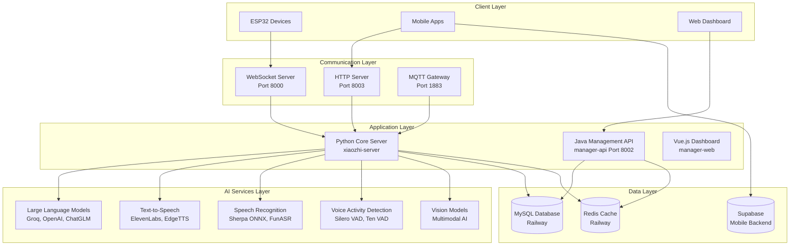
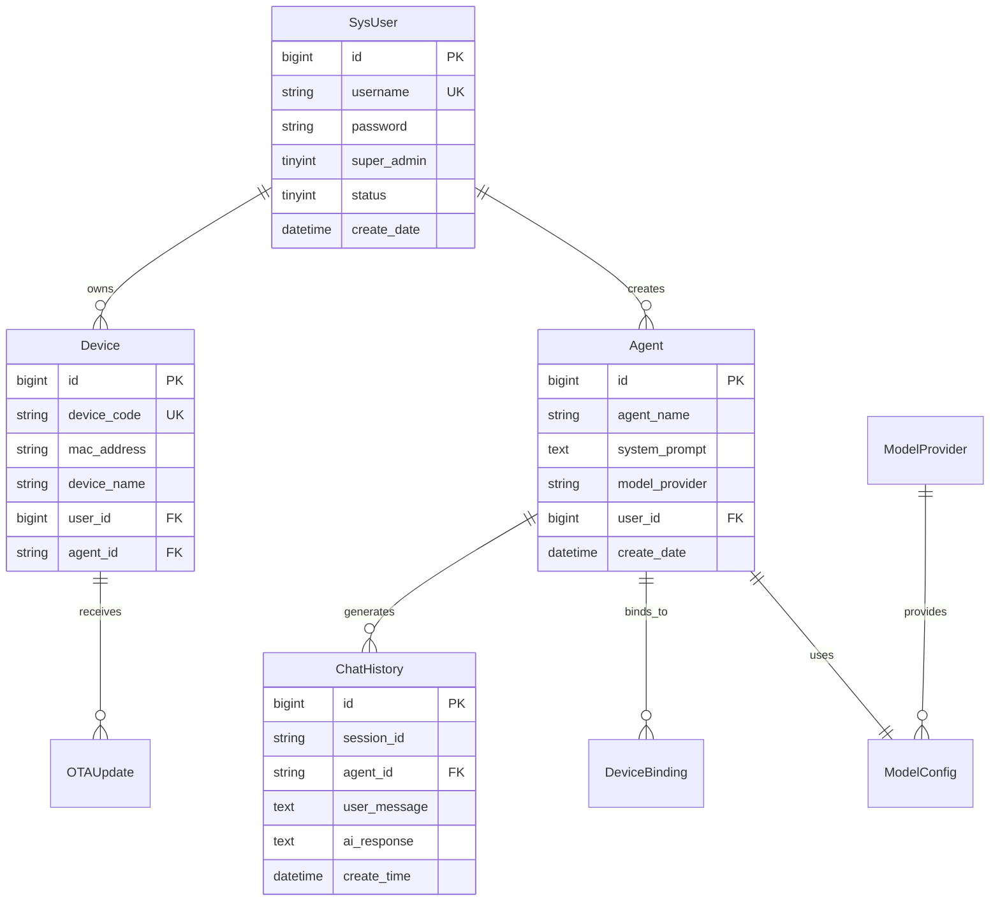
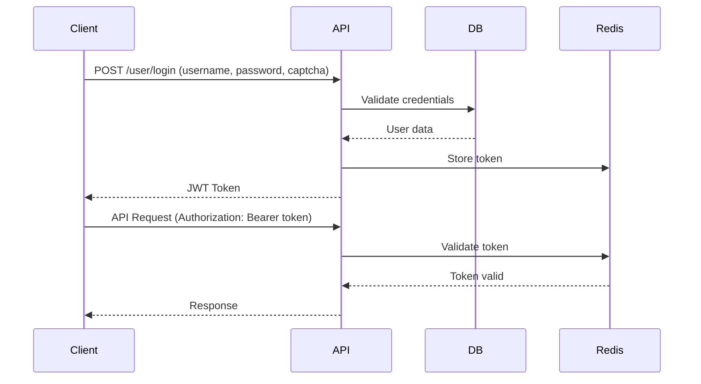
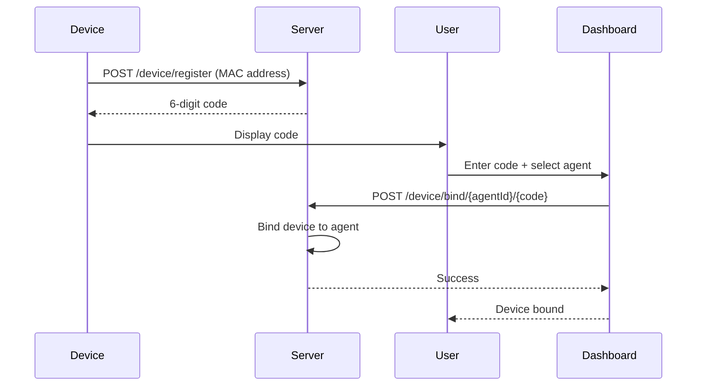

# Cheeko Server - Comprehensive Codebase Analysis

## Overview

This document provides a detailed analysis of the Cheeko Server codebase, an AI toy backend system originally developed by a Chinese team. The system is designed for voice-interactive smart devices with comprehensive management capabilities.

## 🏗️ System Architecture



## 📦 Module Structure

### 1. Python Core Server (`main/xiaozhi-server/`)

```
xiaozhi-server/
├── core/
│   ├── websocket_server.py          # Main WebSocket server
│   ├── http_server.py               # HTTP API server
│   ├── connection.py                # Connection handler
│   ├── providers/                   # AI service providers
│   │   ├── llm/                     # Language models
│   │   │   ├── openai/              # OpenAI-compatible APIs
│   │   │   ├── ollama/              # Ollama integration
│   │   │   └── gemini/              # Google Gemini
│   │   ├── tts/                     # Text-to-speech
│   │   │   ├── elevenlabs.py        # ElevenLabs TTS
│   │   │   ├── edge.py              # Edge TTS
│   │   │   └── fishspeech.py        # Local TTS
│   │   ├── asr/                     # Speech recognition
│   │   │   ├── sherpa_onnx_local.py # Local Sherpa
│   │   │   ├── openai.py            # Whisper API
│   │   │   └── doubao_stream.py     # Streaming ASR
│   │   ├── vad/                     # Voice activity detection
│   │   │   ├── silero.py            # Silero VAD
│   │   │   └── ten_vad_onnx.py      # Ten VAD ONNX
│   │   └── memory/                  # Memory systems
│   │       ├── mem_local_short.py   # Local memory
│   │       └── mem0ai.py            # Mem0 AI service
│   └── utils/                       # Utility modules
├── config/                          # Configuration management
├── plugins_func/                    # Function plugins
│   └── functions/
│       ├── get_weather.py           # Weather plugin
│       ├── get_news_from_newsnow.py # News plugin
│       └── play_music.py            # Music plugin
└── models/                          # Local AI models
```

### 2. Java Management API (`main/manager-api/`)

```
manager-api/
├── src/main/java/xiaozhi/
│   ├── modules/
│   │   ├── agent/                   # AI Agent management
│   │   │   ├── controller/          # REST controllers
│   │   │   ├── service/             # Business logic
│   │   │   ├── entity/              # Database entities
│   │   │   └── dto/                 # Data transfer objects
│   │   ├── device/                  # Device management
│   │   ├── model/                   # AI model configuration
│   │   ├── security/                # Authentication & authorization
│   │   ├── sys/                     # System management
│   │   └── mobile/                  # Mobile app APIs
│   └── common/                      # Shared utilities
├── resources/
│   ├── db/changelog/                # Database migrations
│   └── mapper/                      # MyBatis SQL mappings
└── pom.xml                          # Maven dependencies
```

### 3. Vue.js Dashboard (`main/manager-web/`)

```
manager-web/
├── src/
│   ├── views/                       # Page components
│   │   ├── home.vue                 # Dashboard home
│   │   ├── DeviceManagement.vue     # Device management
│   │   ├── ModelConfig.vue          # AI model configuration
│   │   └── UserManagement.vue       # User administration
│   ├── components/                  # Reusable components
│   │   ├── DeviceItem.vue           # Device card component
│   │   ├── AddDeviceDialog.vue      # Device addition dialog
│   │   └── ChatHistoryDialog.vue    # Chat history viewer
│   ├── apis/                        # API integration
│   └── router/                      # Vue Router configuration
└── package.json                     # NPM dependencies
```

## 🗄️ Database Schema

### Core Tables Structure

```sql
-- System Management
sys_user                    # User accounts
sys_user_token             # Authentication tokens
sys_params                 # System parameters
sys_dict_type              # Dictionary types
sys_dict_data              # Dictionary data

-- AI Agents
ai_agent                   # Agent configurations
ai_agent_template          # Agent templates
ai_agent_chat_history      # Conversation history
ai_agent_chat_audio        # Audio recordings

-- Device Management
device                     # Device registry
device_ota                 # OTA firmware updates
device_ota_mag             # OTA management

-- Model Configuration
model_config               # AI model settings
model_provider             # Service providers

-- Mobile App (Supabase)
parent_profiles            # Parent account data
conversations              # Chat sessions
device_activations         # Mobile device setup
health_metrics             # Usage analytics
```

### Entity Relationships



## 🔌 API Endpoints Reference

### Authentication APIs

```http
POST /xiaozhi/user/login
POST /xiaozhi/user/register
GET  /xiaozhi/user/captcha?uuid={uuid}
POST /xiaozhi/user/smsVerification
GET  /xiaozhi/user/info
```

### Device Management APIs

```http
POST /xiaozhi/device/register
POST /xiaozhi/device/bind/{agentId}/{deviceCode}
GET  /xiaozhi/device/bind/{agentId}
POST /xiaozhi/device/unbind
PUT  /xiaozhi/device/update/{id}
```

### Agent Management APIs

```http
GET    /xiaozhi/agent/list
POST   /xiaozhi/agent/save
PUT    /xiaozhi/agent/update
DELETE /xiaozhi/agent/delete/{id}
GET    /xiaozhi/agent/chat/history/{agentId}
POST   /xiaozhi/agent/mcp/call
```

### Model Configuration APIs

```http
GET  /xiaozhi/model/list
POST /xiaozhi/model/save
PUT  /xiaozhi/model/update
GET  /xiaozhi/provider/list
POST /xiaozhi/provider/test
```

### Mobile App APIs

```http
GET  /xiaozhi/mobile/dashboard/{parentId}
POST /xiaozhi/mobile/activation
GET  /xiaozhi/mobile/conversations/{parentId}
POST /xiaozhi/mobile/health/metrics
GET  /xiaozhi/mobile/profile/{parentId}
```

## 🤖 AI Service Integration

### Supported LLM Providers

| Provider    | Type              | Configuration      | Free Tier  |
| ----------- | ----------------- | ------------------ | ---------- |
| **Groq**    | OpenAI Compatible | API Key + Base URL | ✅ Limited |
| **ChatGLM** | OpenAI Compatible | API Key            | ✅ Yes     |
| **Gemini**  | OpenAI Compatible | API Key            | ✅ Yes     |
| **Ollama**  | Local/Self-hosted | Local URL          | ✅ Yes     |
| **Dify**    | Platform API      | API Key + App ID   | ❌ Paid    |
| **Coze**    | Platform API      | API Key            | ✅ Limited |

### Speech Services Configuration

#### Text-to-Speech (TTS)

```yaml
TTS:
  elevenlabs:
    api_key: "sk_xxx"
    voice_id: "vGQNBgLaiM3EdZtxIiuY"
    model_id: "eleven_turbo_v2_5"
    stability: 0.75
    similarity_boost: 0.75
    speaking_rate: 0.8

  siliconflow:
    access_token: "sk_xxx"
    model: "FunAudioLLM/CosyVoice2-0.5B"
    voice: "diana"
    speed: 1.0
```

#### Automatic Speech Recognition (ASR)

```yaml
ASR:
  SherpaASR:
    type: sherpa_onnx_local
    model_dir: models/sherpa-onnx-sense-voice-zh-en-ja-ko-yue-2024-07-17
    language: "en"
    language_priority: ["en", "en-US"]

  groq_whisper:
    type: openai
    api_key: "${GROQ_API_KEY}"
    model: whisper-large-v3
    language: en
    temperature: 0.0
```

### Voice Activity Detection (VAD)

```yaml
VAD:
  SileroVAD:
    type: silero
    threshold: 0.5
    model_dir: models/snakers4_silero-vad
    min_silence_duration_ms: 1000

  TenVAD_ONNX:
    type: ten_vad_onnx
    threshold: 0.6
    frame_size: 512
    sample_rate: 16000
```

## 🔐 Security Implementation

### Authentication Flow



### Device Binding Process



## 🎯 Function Plugin System

### Weather Plugin Example

```python
# plugins_func/functions/get_weather.py
async def get_weather(location: str = "Bangalore") -> str:
    """Get current weather information for a location"""
    api_key = config["plugins"]["get_weather"]["api_key"]
    url = f"https://api.openweathermap.org/data/2.5/weather"
    params = {
        "q": location,
        "appid": api_key,
        "units": "metric",
        "lang": "en"
    }

    async with httpx.AsyncClient() as client:
        response = await client.get(url, params=params)
        data = response.json()

    return f"Weather in {location}: {data['main']['temp']}°C, {data['weather'][0]['description']}"
```

### Function Call Configuration

```yaml
Intent:
  function_call:
    type: function_call
    functions:
      - play_music
      - get_weather
      - get_indian_news_api
      - get_news_from_newsnow
```

## 📱 Mobile Integration Architecture

### Supabase Backend Structure

```sql
-- Parent Profiles
CREATE TABLE parent_profiles (
    id UUID PRIMARY KEY DEFAULT gen_random_uuid(),
    email TEXT UNIQUE NOT NULL,
    name TEXT NOT NULL,
    subscription_tier TEXT DEFAULT 'free',
    created_at TIMESTAMP DEFAULT NOW()
);

-- Device Activations
CREATE TABLE device_activations (
    id UUID PRIMARY KEY DEFAULT gen_random_uuid(),
    parent_id UUID REFERENCES parent_profiles(id),
    device_serial TEXT UNIQUE NOT NULL,
    activation_code TEXT NOT NULL,
    is_active BOOLEAN DEFAULT FALSE,
    activated_at TIMESTAMP
);

-- Conversations
CREATE TABLE conversations (
    id UUID PRIMARY KEY DEFAULT gen_random_uuid(),
    parent_id UUID REFERENCES parent_profiles(id),
    child_name TEXT NOT NULL,
    message_count INTEGER DEFAULT 0,
    last_interaction TIMESTAMP DEFAULT NOW()
);
```

### Mobile API Integration

```java
@RestController
@RequestMapping("/mobile")
public class MobileDashboardController {

    @GetMapping("/dashboard/{parentId}")
    public Result<DashboardData> getDashboard(@PathVariable String parentId) {
        // Fetch from Supabase
        SupabaseClient supabase = createSupabaseClient();
        DashboardData data = supabase.from("parent_profiles")
            .select("*, conversations(*), device_activations(*)")
            .eq("id", parentId)
            .single()
            .execute();

        return Result.ok(data);
    }
}
```

## 🚀 Deployment Configurations

### Docker Compose Setup

```yaml
version: "3.8"
services:
  xiaozhi-server:
    build:
      context: .
      dockerfile: Dockerfile-server
    ports:
      - "8000:8000"
      - "8003:8003"
    environment:
      - CONFIG_FROM_API=true
    volumes:
      - ./models:/app/models

  manager-api:
    build:
      context: ./main/manager-api
    ports:
      - "8002:8002"
    environment:
      - SPRING_PROFILES_ACTIVE=prod
      - MYSQL_URL=${MYSQL_URL}
      - REDIS_URL=${REDIS_URL}
    depends_on:
      - mysql
      - redis

  manager-web:
    build:
      context: ./main/manager-web
      dockerfile: Dockerfile-web
    ports:
      - "80:80"
    depends_on:
      - manager-api

  mqtt-gateway:
    build:
      context: ./main/mqtt-gateway
    ports:
      - "1883:1883"
      - "8884:8884"
```

### Environment Variables

```bash
# Database Configuration
MYSQL_URL=jdbc:mysql://railway.proxy.rlwy.net:41629/railway
MYSQL_USERNAME=root
MYSQL_PASSWORD=xxx

# Redis Configuration
REDIS_HOST=shortline.proxy.rlwy.net
REDIS_PORT=54353
REDIS_PASSWORD=xxx

# Supabase Configuration
SUPABASE_URL=https://nstiqzvkvshqglfqmlxs.supabase.co
SUPABASE_ANON_KEY=eyJhbGciOiJIUzI1NiIsInR5cCI6IkpXVCJ9...

# API Keys
GROQ_API_KEY=gsk_xxx
ELEVENLABS_API_KEY=sk_xxx
OPENWEATHER_API_KEY=xxx
```

## 📊 Performance Monitoring

### Logging Configuration

```yaml
log:
  log_level: DEBUG

# Python logging
logger = setup_logging()
logger.bind(tag=TAG).info("Server started successfully")
logger.bind(tag=TAG).error(f"Error occurred: {str(e)}")

# Java logging (logback-spring.xml)
<appender name="FILE" class="ch.qos.logback.core.rolling.RollingFileAppender">
    <file>logs/xiaozhi-esp32-api.log</file>
    <rollingPolicy class="ch.qos.logback.core.rolling.TimeBasedRollingPolicy">
        <fileNamePattern>logs/xiaozhi-esp32-api.%d{yyyy-MM-dd}.%i.log</fileNamePattern>
        <maxFileSize>100MB</maxFileSize>
        <maxHistory>30</maxHistory>
    </rollingPolicy>
</appender>
```

### Health Check Endpoints

```python
# Python health check
@app.route('/health')
async def health_check():
    return {
        "status": "healthy",
        "version": "1.0.0",
        "modules": {
            "vad": vad_provider is not None,
            "asr": asr_provider is not None,
            "llm": llm_provider is not None,
            "tts": tts_provider is not None
        }
    }
```

## 🔧 Configuration Management

### Main Configuration File (`config.yaml`)

```yaml
server:
  ip: 0.0.0.0
  port: 8000
  http_port: 8003
  websocket: ws://192.168.1.118:8000/xiaozhi/v1/
  timezone_offset: +8

prompt: |
  PERSONA: You are Cheeko, a friendly, curious, and playful AI friend for children aged 4+.

response_constraints:
  max_words: 50
  enforce_limit: true

wakeup_words:
  - "hey cheeko"
  - "hi cheeko"
  - "hello cheeko"
  - "cheeko"

selected_module:
  LLM: openai
  TTS: elevenlabs
  VAD: SileroVAD
  ASR: SherpaZipformerGigaspeechEN
  Intent: function_call
  Memory: mem_local_short
```

## 📈 Usage Examples

### WebSocket Communication Example

```javascript
// Client-side WebSocket connection
const ws = new WebSocket("ws://localhost:8000/xiaozhi/v1/");

// Send audio data
ws.send(
  JSON.stringify({
    type: "audio",
    data: audioBase64,
    sessionId: "session_123",
  })
);

// Receive responses
ws.onmessage = (event) => {
  const response = JSON.parse(event.data);
  if (response.type === "tts_audio") {
    playAudio(response.data);
  }
};
```

### Device Registration Flow

```python
# Device registration
POST /device/register
{
    "macAddress": "AA:BB:CC:DD:EE:FF"
}

# Response: 6-digit code
{
    "code": 0,
    "msg": "success",
    "data": "123456"
}

# Device binding
POST /device/bind/agent_123/123456
{
    "code": 0,
    "msg": "Device bound successfully"
}
```

### Agent Creation Example

```json
POST /agent/save
{
    "agentName": "My AI Assistant",
    "systemPrompt": "You are a helpful AI assistant for children.",
    "modelProvider": "openai",
    "temperature": 0.7,
    "maxTokens": 100,
    "voiceId": "vGQNBgLaiM3EdZtxIiuY"
}
```

## 🎯 Key Findings Summary

1. **Architecture**: Well-structured 3-tier system with clear separation of concerns
2. **Scalability**: Docker-ready with microservice architecture potential
3. **AI Integration**: Comprehensive support for multiple AI providers
4. **Security**: Robust authentication with token-based access control
5. **Mobile Ready**: Supabase integration for mobile app backend
6. **Extensibility**: Plugin system for custom functions
7. **Production Ready**: Railway deployment with monitoring and logging

## 📚 Technology Stack Summary

| Layer             | Technology                | Purpose                        |
| ----------------- | ------------------------- | ------------------------------ |
| **Frontend**      | Vue.js 2.x, Element UI    | Web dashboard                  |
| **Backend API**   | Spring Boot, MyBatis Plus | Management API                 |
| **AI Engine**     | Python, WebSocket, HTTP   | Core AI processing             |
| **Database**      | MySQL, Redis, Supabase    | Data persistence               |
| **Communication** | WebSocket, MQTT, HTTP     | Real-time communication        |
| **AI Services**   | OpenAI, ElevenLabs, Groq  | LLM, TTS, ASR                  |
| **Deployment**    | Docker, Railway, Nginx    | Production hosting             |
| **Security**      | Apache Shiro, JWT         | Authentication & authorization |

This analysis provides a comprehensive understanding of the Cheeko Server codebase, suitable for development planning and system extension.
